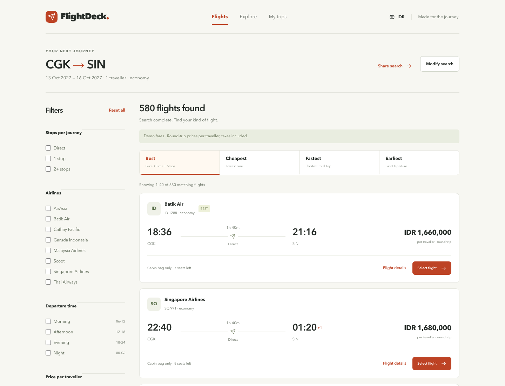

# FlightDeck

**Find the right flight, faster.**

A complete flight discovery and comparison portfolio built with Nuxt, Vue and TypeScript. Search, compare progressively arriving provider offers, refine your options, inspect the full journey and review a selected itinerary.



[Homepage](docs/screenshots/home-desktop.png) · [Mobile results](docs/screenshots/results-mobile.png) · [Flight details](docs/screenshots/details-desktop.png) · [Itinerary review](docs/screenshots/review-desktop.png) · [Architecture](docs/architecture.md)

## The experience

- Airport autocomplete over HTTP, with 300 ms debounce, cancellation, loading/error/retry states and keyboard navigation.
- One-way and round-trip searches, airport swap, dates, adults/children and four cabin classes.
- Three deterministic mock providers with 400 / 900 / 1500 ms delays and occasional partial failure.
- Up to 660 offers / **580 unique itineraries**, including real outbound and return segment structures.
- Progressive results that stay usable while remaining providers load; cheapest-offer deduplication.
- Direct/1-stop/2+-stop, airline, departure-time, price and duration filters; Best, Cheapest, Fastest and Earliest sorting.
- Search, filter, sort, page and detail state in shareable URLs. Refresh preserves your search and selected review.
- Accessible detail drawer, segment timeline, layovers, local airport times, baggage, fare and party total.
- Responsive filters sheet and 40-result pagination to keep the DOM bounded.

**All fares, schedules, availability and provider names are simulated. Booking, payment, authentication and airline integration are intentionally outside this demo.**

All 13 implementation phases are represented in the local application, testing and documentation. A public live demo has not been deployed; no hosting destination was supplied.

## Running the project

### Prerequisites

- Use Node.js 24; the version used in this development environment is **24.14.1**.
- Use npm and retain `package-lock.json` to keep dependency versions consistent.
- No database, API key, or `.env` file is required. The project's Nuxt server provides the mock data.

### Development

Run these commands from the project root, where `package.json` is located:

```sh
npm ci
npm run dev
```

Open [http://localhost:3000](http://localhost:3000). Code changes update automatically while the development server is running. Press `Ctrl+C` to stop it.

`npm ci` also runs `postinstall` (`nuxt prepare`) to generate Nuxt configuration and types in `.nuxt/`.

If port 3000 is already in use:

```sh
npm run dev -- --port 3001
```

### Production build and preview

```sh
npm run build
npm run preview
```

Open the address shown in the terminal. The build produces the `.output/` directory. To run the build directly as a Node server:

```sh
node .output/server/index.mjs
```

On macOS/Linux, configure the host and port as follows:

```sh
PORT=3000 HOST=127.0.0.1 node .output/server/index.mjs
```

Deployment requires a server that can run Node.js because flight search uses Nuxt API endpoints. The `npm run generate` script is available, but static output alone does not provide the APIs the application needs.

## Tech stack

The major versions below reflect the dependencies in `package.json`; installed versions are locked in `package-lock.json`.

| Layer                | Technology                               | Responsibility                                                            |
| -------------------- | ---------------------------------------- | ------------------------------------------------------------------------- |
| Framework            | Nuxt 4                                   | File-based routing, layouts, SSR, and server endpoints through Nitro      |
| UI                   | Vue 3 Composition API                    | Components and interface interactions                                     |
| Language             | TypeScript 6 with strict mode            | Application types; Vue components are checked with `vue-tsc`              |
| Styling              | Tailwind CSS 4 and custom CSS            | Visual tokens, responsive layouts, and component styling                  |
| Server state         | TanStack Vue Query 5                     | API caching, loading, retries, and request cancellation                   |
| Client state         | Pinia 4                                  | Stores the selected itinerary identity                                    |
| URL state            | Vue Router 5                             | Search, filters, sorting, pagination, and details in URL query parameters |
| Validation           | Zod 4                                    | Runtime validation of search criteria and API data                        |
| Demo backend         | Nuxt server routes                       | Airport catalog and simulated provider offers                             |
| Unit/component tests | Vitest 5, Vue Testing Library, happy-dom | Domain logic and component interactions                                   |
| E2E tests            | Playwright                               | Application flows in desktop Chromium and mobile emulation                |
| Code quality         | Nuxt ESLint and Prettier                 | Linting and code formatting                                               |

## Project structure

```text
flight-deck/
├── app/
│   ├── assets/css/           # Main CSS and visual tokens
│   ├── components/           # Artwork and shared UI components
│   │   └── ui/               # AppIcon and AppDialog
│   ├── layouts/              # Application layouts
│   ├── pages/                # Pages and Nuxt routing
│   │   ├── index.vue         # / — homepage and search form
│   │   ├── flights.vue       # /flights — search results
│   │   └── review.vue        # /review — selected itinerary review
│   ├── plugins/              # Vue Query registration
│   └── app.vue               # Application root
├── features/
│   ├── airport-search/
│   │   ├── api/              # Airport search API client
│   │   └── data/             # Airport display catalog
│   ├── flight-search/
│   │   ├── api/              # Flight search and detail API clients
│   │   ├── components/       # Form, airport picker, cards, and journey details
│   │   ├── composables/      # Provider request orchestration with Vue Query
│   │   ├── schemas/          # Search input validation
│   │   └── utils/            # URL parsing, deduplication, filtering, and ranking
│   └── flight-filters/
│       └── components/       # Flight results filter controls
├── server/
│   ├── api/                  # Airport and flight HTTP endpoints
│   ├── data/                 # Server airport data
│   └── utils/                # Flight generator and simulated provider delays
├── shared/
│   ├── contracts/            # Zod schemas, DTO/domain types, and API data mappers
│   └── utils/                # Currency, date, duration, and timezone formatting
├── stores/                   # Pinia store for the selected itinerary
├── public/                   # Static assets such as favicons and robots.txt
├── tests/
│   ├── unit/                 # Domain logic and validation tests
│   ├── component/            # Vue component interaction tests
│   ├── e2e/                  # Application flow tests with Playwright
│   ├── setup.ts              # DOM matchers and component cleanup
│   ├── tsconfig.json         # Test-specific TypeScript configuration
│   └── vue.d.ts              # .vue import declarations for plain TypeScript
├── scripts/                  # Screenshot capture and results logic profiling
├── docs/                     # Architecture, screenshots, and performance data
├── nuxt.config.ts            # Nuxt, module, styling, and TypeScript configuration
├── vitest.config.ts          # Unit/component test configuration
├── playwright.config.ts      # Desktop/mobile E2E configuration
├── tsconfig.json             # TypeScript project references
└── package.json              # Dependencies and project scripts
```

The `.nuxt/`, `.output/`, and `node_modules/` directories are generated by tooling. Make application changes in the source directories above.

### Responsibilities

- `app/` assembles pages, layouts, and shared UI. Add new pages in `app/pages/`.
- `features/` organizes business behavior by feature. Flight search and form changes belong in `features/flight-search/`.
- `server/` handles HTTP requests and provides mock data.
- `shared/` contains data contracts and utilities used by both client and server.
- `stores/` holds user selections. Vue Query manages provider responses, while state that must be shareable or restored after refresh lives in the URL.

### Data flow and API

Search form → criteria validation → URL query parameters → requests to each provider → response validation and mapping → deduplication → filtering/sorting → results display.

| Endpoint                   | Purpose                                                               |
| -------------------------- | --------------------------------------------------------------------- |
| `GET /api/airports?q=...`  | Looks up airports for autocomplete                                    |
| `POST /api/flights/search` | Accepts `{ criteria, provider }` and returns offers from one provider |
| `GET /api/flights/:id`     | Retrieves itinerary details by identity                               |

The three mock providers (Alpha, Bravo, Charlie) have delays of 400, 900, and 1500 ms. Results appear progressively as each request completes. Charlie can fail deterministically for certain criteria; results from the other providers remain usable.

See [docs/architecture.md](docs/architecture.md) for more on state ownership, request lifecycles, deduplication, and design decisions.

## Development and testing commands

| Command                | Purpose                                   |
| ---------------------- | ----------------------------------------- |
| `npm run dev`          | Starts the development server             |
| `npm run build`        | Creates a production build                |
| `npm run preview`      | Previews the production build             |
| `npm run typecheck`    | Checks project types through Nuxt         |
| `npm run lint`         | Checks ESLint rules                       |
| `npm run format:check` | Checks formatting without modifying files |
| `npm run format`       | Formats project files with Prettier       |
| `npm test`             | Runs unit and component tests once        |
| `npm run test:watch`   | Runs Vitest in watch mode                 |
| `npm run test:e2e`     | Runs Playwright browser tests             |

To run a single test file:

```sh
npm test -- tests/component/search.test.ts
```

To check test file types and their imported Vue components:

```sh
npx vue-tsc --noEmit -p tests/tsconfig.json
```

For E2E tests, install Chromium during initial setup, then build the application before running the tests:

```sh
npx playwright install chromium
npm run build
npm run test:e2e
```

Playwright starts its own production server at **http://127.0.0.1:3100**. Keep port 3100 free; you do not need to run `npm run dev` for these tests. Rebuild after application code changes before running E2E tests.

## Reproduce screenshots and measurements

Run the production server on port 3200, then:

```sh
PORT=3200 HOST=127.0.0.1 node .output/server/index.mjs
# In another terminal:
node scripts/capture.mjs
node scripts/profile.mjs
```

Set `FLIGHTDECK_CAPTURE_URL` to capture another local preview. Scripts save [screenshots](docs/screenshots) and raw [domain performance measurements](docs/performance.json).

The time-of-day filter was optimized from **25.81 ms to 0.60 ms median** by reusing Intl formatters, with raw before/after evidence checked in. The 580-itinerary pipeline was measured at approximately **3 ms median** locally. These are unthrottled development-machine measurements, not a Lighthouse score or a production SLA. Pagination limits rendering to 40 cards; no virtualization or WebSockets were added. Full methodology and limitations are documented in [architecture.md](docs/architecture.md).

## Try the resilience behavior

A normal one-adult CGK → SIN round trip on **13–16 October 2027** produces all 580 unique itineraries. **12–16 October 2027** deterministically triggers Charlie's partial failure. Other criteria also occasionally trigger failure according to the documented seed policy.

The remaining failure cases are simulated in Playwright by intercepting HTTP responses, so no test-only fault switches are exposed in the application API.

## Next improvements

A real provider adapter with server-only credentials; fare revalidation before external handoff; provider market/schedule realism; broader browser and screen-reader testing; and field performance measurement on a deployed host. Actual booking remains a separate product scope.
